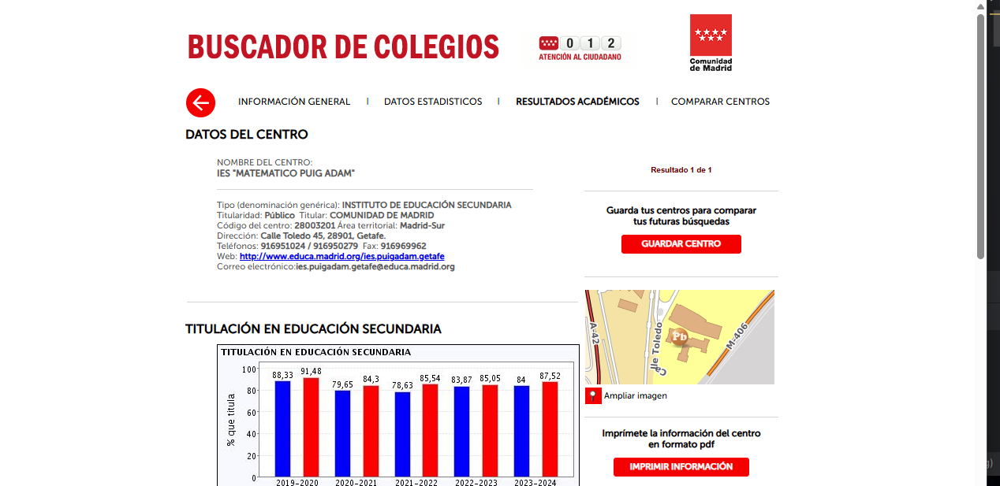
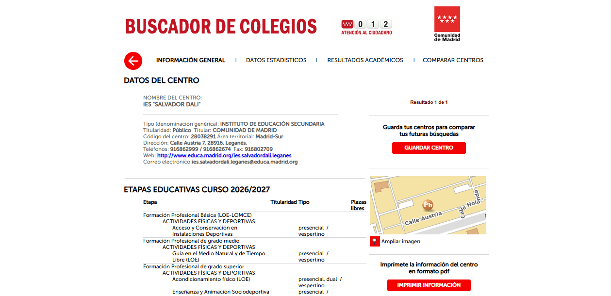
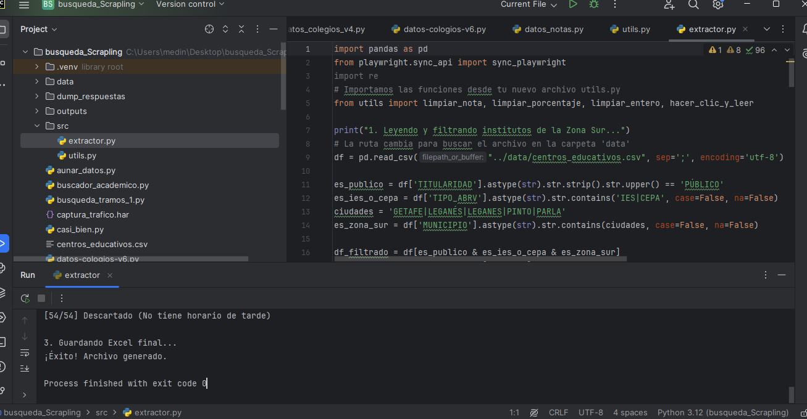
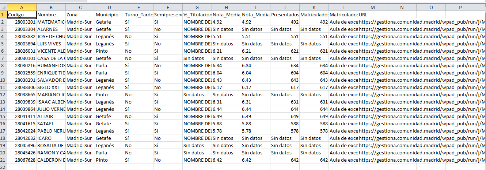

# Madrid-Education-Statistics-Extractor


---

## Automated extraction of public educational statistics from the Community of Madrid using browser automation and HTML parsing.

Madrid-Education-Statistics-Extractor is an open-source Python project that automatically collects academic indicators published by the **Community of Madrid** for public secondary schools.

The project combines **browser automation**, **dynamic HTML parsing**, and **data processing** to extract information that would otherwise require navigating hundreds of web pages manually.

The extracted data are exported as structured CSV files suitable for statistical analysis, educational research and further processing.

---

# Table of Contents

- Overview
- Why this project?
- Features
- Technologies
- Project Architecture
- Project Structure
- Installation
- Running the extractor
- Screenshots
- Example Output
- Output Dataset
- Roadmap
- Current Limitations
- Development
- Contributing
- License
- Author

---

# Overview

The Community of Madrid publishes educational statistics through an interactive web portal.

Although these data are publicly available, they are distributed across hundreds of dynamically generated pages requiring user interaction (menus, tabs, buttons and selectors).

This project automates the entire extraction process using browser automation and HTML parsing.

Instead of manually consulting every school, the extractor automatically visits every page, interacts with the interface, extracts the required indicators and exports them into a structured dataset.

---

# Why this project?

Educational data are increasingly important for researchers, teachers, families and public administrations.

Unfortunately, obtaining those data manually is extremely time-consuming because:

- information is spread across hundreds of pages;
- most statistics are generated dynamically;
- user interaction is required before tables become visible;
- no official bulk download is available.

This project solves that problem by providing a fully automated and reproducible extraction pipeline.

---

# Features

- Automatic navigation through the official Community of Madrid education portal.
- Browser automation using Playwright.
- Automatic interaction with menus, tabs and buttons.
- Dynamic HTML parsing using BeautifulSoup.
- Table extraction using Pandas.
- Automatic detection of:
  - Afternoon education.
  - Semi-presential education.
- Extraction of:
  - EvAU average grade.
  - Academic record average.
  - Number of EvAU candidates.
  - Number of enrolled students.
  - ESO graduation rate.
  - Bachillerato enrolment.
- Automatic CSV generation.
- Modular project architecture.

---

# Technologies

- Python
- Playwright
- BeautifulSoup4
- Pandas
- HTML Parsing
- Browser Automation
- Data Extraction
- CSV Processing

---

# Project Architecture

```
                    +----------------------+
                    |  School Codes (CSV)  |
                    +----------+-----------+
                               |
                               |
                               ▼
                    +----------------------+
                    |      Playwright      |
                    | Browser Automation   |
                    +----------+-----------+
                               |
                               ▼
          Community of Madrid Education Portal
                               |
                               ▼
                    +----------------------+
                    |  Dynamic HTML Pages  |
                    +----------+-----------+
                               |
                               ▼
                    +----------------------+
                    |   BeautifulSoup      |
                    |    HTML Parsing      |
                    +----------+-----------+
                               |
                               ▼
                    +----------------------+
                    |       Pandas         |
                    | Data Processing      |
                    +----------+-----------+
                               |
                               ▼
                    +----------------------+
                    |     CSV Dataset      |
                    +----------------------+
```

---

# Project Structure

```
Madrid-Education-Statistics-Extractor/

│
├── README.md
├── LICENSE
├── requirements.txt
├── pyproject.toml
├── .gitignore
│
├── src/
│   ├── extractor.py
│   └── utils.py
│
├── data/
│   └── centros_educativos.csv
│
├── outputs/
│
├── screenshots/
│
└── docs/
```

---

# Installation

Clone the repository:

```bash
git clone https://github.com/medinamedinan/Madrid-Education-Statistics-Extractor.git

cd Madrid-Education-Statistics-Extractor
```

Install the required Python libraries:

```bash
pip install -r requirements.txt
```

Install the Playwright browser:

```bash
playwright install chromium
```

> **Important**
>
> Playwright requires Chromium to be installed.
> The extractor will not work correctly unless the browser has been installed.

---

# Running the extractor
python src/extractor.py


---

# Screenshots

## Program execution

Place the following image inside:

Automated navigation through the official portal:



Real-time data extraction:


3. Final structured dataset:


---

## Generated CSV

Place:
screenshots/csv_output.png


and include:

```markdown


## Architecture

Optionally create:

```
screenshots/architecture.png
```

and include:

```markdown

```

---

# Example Output

```
[1/37]

IES Matemático Puig Adam

EvAU Average Grade ............. 7.81

Academic Record ................ 8.24

ESO Graduation Rate ............ 95.40 %

Bachillerato Students .......... 241

EvAU Candidates ................ 132
```

---

# Output Dataset

The generated CSV includes fields such as:

| Field |
|--------|
| School Code |
| School Name |
| Municipality |
| Educational Area |
| Afternoon Education |
| Semi-presential Education |
| ESO Graduation Rate |
| EvAU Average Grade |
| Academic Record |
| EvAU Candidates |
| Bachillerato Enrolment |

---

# Development

The project follows a modern Python project structure.

Dependencies are managed using:

- requirements.txt
- pyproject.toml

Project metadata are stored in **pyproject.toml**, following modern Python packaging standards.

---

# Roadmap

- Excel export.
- Municipality rankings.
- Statistical summaries.
- Interactive dashboards.
- Automatic charts.
- Multi-year comparisons.
- Additional educational indicators.
- Improved error handling.
- Parallel extraction.

---

# Current Limitations

The extractor depends on the current HTML structure of the Community of Madrid portal.

Future modifications to the website may require updating selectors or extraction logic.

---

# Contributing

Suggestions, pull requests and improvements are welcome.

If you discover bugs or have ideas for new features, please open an Issue.

---

# License

This project is distributed under the MIT License.

---

# Author

Developed and maintained by **medinamedinan**.

If you find this project useful, consider giving it a ⭐ on GitHub.
